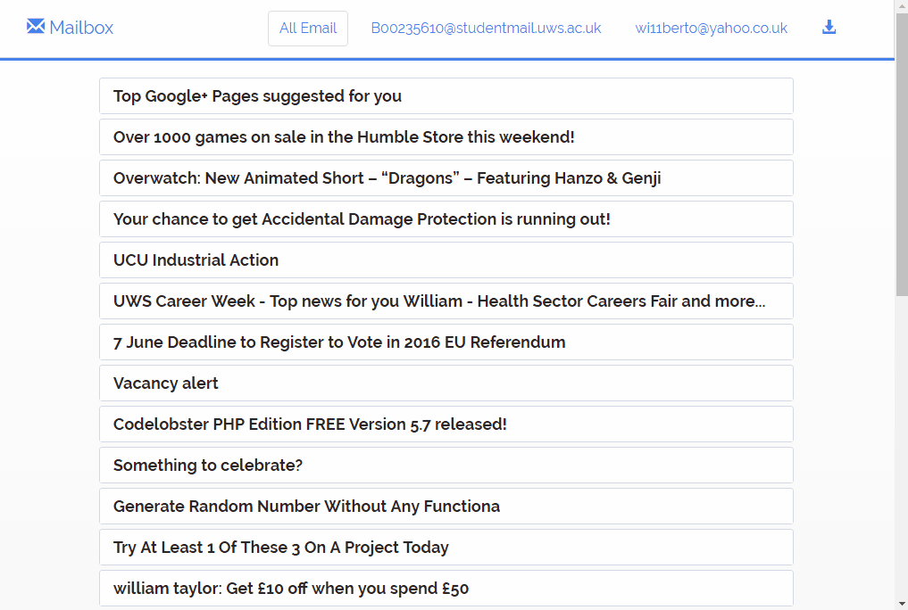

# Mailbox &nbsp; &nbsp; &nbsp; &nbsp; &nbsp;   

As a little experiment I created a custom frontend to my personal email accounts. I wanted to experiment with the Bootstrap bindings for React as well as the IMAP protocol for accessing and streaming emails from email services. Ideally when taken forward I would like to have my own email service that just integrates seemlessly with personal email accounts as well as work accounts and student accounts.

## Overview

The application was built with React along with React-Bootstrap. It also uses Webpack for module bundeling. The application is very simple it just uses the Fetch API to hit a Node.js endpoint to request the emails to view. The Node server is a bit more complex. Upon startup it uses IMAP protocol to connect to the email clients and then uploads all received emails into DynamoDB a NoSQL database. Once there endpoints are setup for the frontend to query the database and display what is there.

## Development

While I am not planning to add to this project in the near future there are many features I could implement, these potential options are listed below.

* Add Emails Dynamically 
* User Account
* Spam Filters

## License

Apache 2.0
